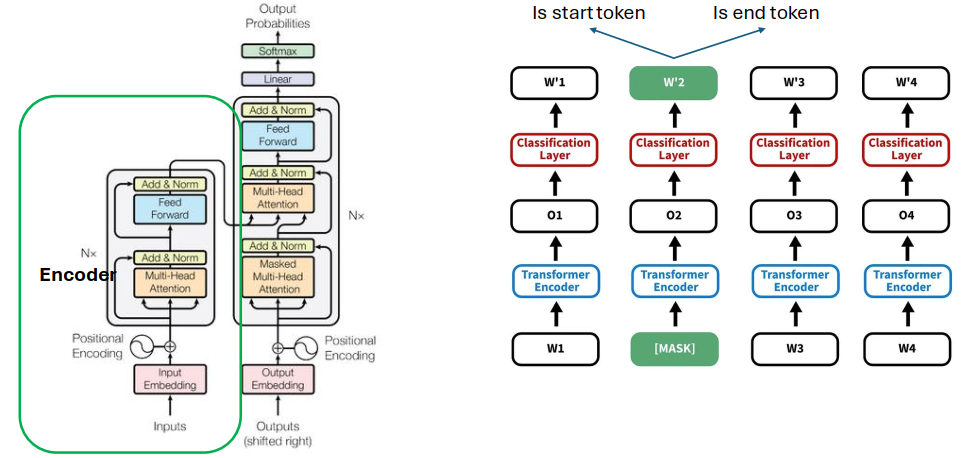

# Open domain question answering

## Dataset
- Stanford Question Answering Dataset (SQuAD): [Squadv2.0](https://huggingface.co/datasets/rajpurkar/squad_v2)

## Methodology
- Pipeline

- Extractive QA model (BERTs)

- Reader: [qa-squadv2-distilbert](https://huggingface.co/hoannc0506/qa-squadv2-distilbert)
- Retriever: [distilbert-base-uncased](https://huggingface.co/distilbert/distilbert-base-uncased)

## Results
| Model | F1 |
| ----------- | ----------- |
| qa-squadv2-distilbert | 52.42 |

## Uses
- Visualize data preprocessing: `DatasetVisualize.ipynb`
- Test Retriever: `Retriever.ipynb`
- Evaluate Reader: `Evaluate.ipynb`
- Train extractive reader:
    - Modify `config.py`
    - Run `python train_reader.py`
    - Example train log: [train_log](https://wandb.ai/hoannc6/Open-Domain-QA)

## To-Do
- [ ] Evaluate generative model on Eli5
- [ ] Evaluate with LLM

## Referneces
- [Question answering - HF course](https://huggingface.co/learn/nlp-course/chapter7/7?fw=pt)